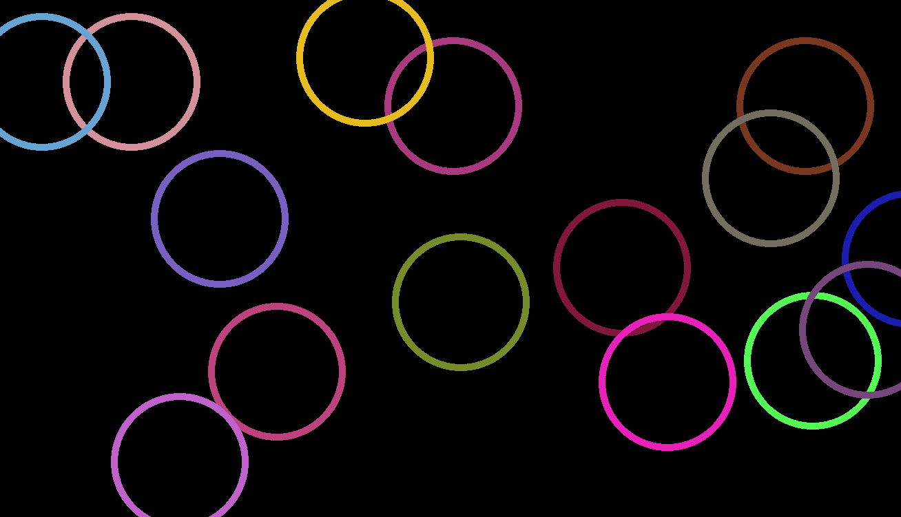

# Art-factal-Bulles-multicilores

## Description
Il s'agit d'un projet d'art factal, présentant un ensemble de bulles qui se déplacent sur une fenêtre tout en changeant alternativement de couleur. Le projet est réalisé avec le langage Python

## Illustration

